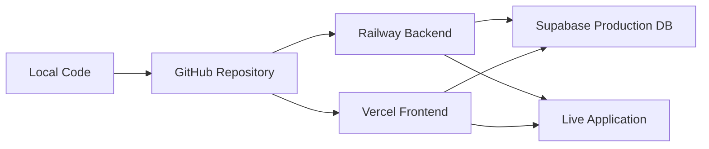

# 🎯 Deployment Summary & Next Actions

**Project:** Personal AI Assistant
**Status:** ✅ Ready for Deployment
**Date:** November 3, 2025

---

## ✅ What's Been Completed

### **1. Code & Features (100% Complete)**
- ✅ All 8 phases implemented (194/194 tasks)
- ✅ Multi-agent system (RAG, SQL, Research)
- ✅ Real-time chat with WebSocket streaming
- ✅ Document upload with hybrid search
- ✅ Database query generation
- ✅ Graduate research capabilities
- ✅ Budget tracking and usage analytics
- ✅ Comprehensive error handling

### **2. Project Organization (100% Complete)**
- ✅ Project cleanup executed (69% file reduction)
- ✅ Development files organized into proper structure
- ✅ 105 scripts moved to `scripts/` directory
- ✅ 12 dev docs archived to `docs-dev/`
- ✅ Clean root directory (only 8 essential files)

### **3. Deployment Preparation (100% Complete)**
- ✅ `railway.json` created for backend
- ✅ `.env.example` comprehensive template
- ✅ `.gitignore` configured for secrets
- ✅ Deployment documentation created:
  - `DEPLOYMENT_PLAN.md` (comprehensive, 400+ lines)
  - `DEPLOYMENT_QUICK_START.md` (30-minute guide)
  - `DEPLOYMENT_SUMMARY.md` (this file)

---

## 📂 Deployment Files Created

```
master_agent/
├── DEPLOYMENT_PLAN.md              ✅ Full deployment guide
├── DEPLOYMENT_QUICK_START.md       ✅ 30-min quick start
├── DEPLOYMENT_SUMMARY.md           ✅ This summary
├── .env.example                    ✅ Environment template
├── .gitignore                      ✅ Secrets excluded
├── backend/
│   └── railway.json                ✅ Railway config
└── .github/
    └── FUNDING.yml                 ✅ GitHub funding (optional)
```

---

## 🚀 Deployment Strategy (GitHub → Railway → Vercel)



### **Why This Stack?**

| Service | Purpose | Cost | Why It's Best |
|---------|---------|------|---------------|
| **Railway** | Backend (Node.js + WebSocket) | $5-20/mo | Auto-deploy from GitHub, WebSocket support, easy env vars |
| **Vercel** | Frontend (Next.js 15) | $0-20/mo | Made by Next.js creators, zero-config, automatic optimization |
| **Supabase** | Database (PostgreSQL + pgvector) | $0-25/mo | Managed PostgreSQL with vector support, built-in auth |
| **GitHub** | Version Control + CI/CD | Free | Industry standard, integrates with Railway/Vercel |

**Total Monthly Cost:** $20-80 (depending on usage)

---

## 📋 Pre-Deployment Checklist

### **Before Pushing to GitHub:**
- [ ] Review code for any hardcoded secrets
- [ ] Verify `.gitignore` excludes `.env` files
- [ ] Test locally one final time
- [ ] Review README.md for accuracy
- [ ] Ensure all dependencies are in `package.json`

### **API Keys Needed:**
- [ ] OpenAI API key (required)
- [ ] Anthropic API key (required)
- [ ] Supabase credentials (create in deployment)
- [ ] Tavily API key (recommended for research)
- [ ] Cohere API key (optional, for reranking)

---

## 🎬 Deployment Steps (30 Minutes)

### **Quick Path (Recommended):**
Follow `DEPLOYMENT_QUICK_START.md` for a guided 30-minute deployment.

### **Detailed Path:**
Follow `DEPLOYMENT_PLAN.md` for comprehensive instructions with troubleshooting.

### **Step Summary:**
1. **GitHub** (5 min): Push code to repository
2. **Supabase** (10 min): Create production database, run migrations
3. **Railway** (8 min): Deploy backend with environment variables
4. **Vercel** (5 min): Deploy frontend with environment variables
5. **Configure** (2 min): Update CORS, test end-to-end

---

## 🔐 Security Checklist

Before deploying, verify:
- [ ] No API keys in client-side code
- [ ] `.env` files are gitignored
- [ ] Supabase Service Role Key only in backend (Railway)
- [ ] Supabase Anon Key only in frontend (Vercel)
- [ ] CORS configured for Vercel domain only
- [ ] Rate limiting enabled (backend)
- [ ] File upload size limits enforced
- [ ] HTTPS/WSS enforced (no HTTP in production)

---

## 📊 Post-Deployment Tasks

### **Immediately After Deploy:**
1. ✅ Test signup/login flow
2. ✅ Send test chat message
3. ✅ Upload test document
4. ✅ Verify WebSocket connection
5. ✅ Check error logs (Railway, Vercel)

### **Within 24 Hours:**
1. ⏳ Set up uptime monitoring (UptimeRobot, Pingdom)
2. ⏳ Configure error tracking (Sentry recommended)
3. ⏳ Enable database backups (Supabase)
4. ⏳ Set up budget alerts (Railway, Vercel)
5. ⏳ Test from different browsers/devices

### **Within 1 Week:**
1. ⏳ Add custom domain (optional)
2. ⏳ Configure webhooks for deployment notifications
3. ⏳ Set up CI/CD for automated testing (GitHub Actions)
4. ⏳ Create user documentation
5. ⏳ Plan first feature iteration

---

## 💰 Cost Optimization Tips

### **Free Tier Strategy (Prototype/MVP):**
- Supabase Free: $0 (500MB database limit)
- Railway Hobby: $5 (512MB RAM)
- Vercel Hobby: $0 (100GB bandwidth)
- **Total:** ~$5/month + AI API usage

### **Production Strategy:**
- Supabase Pro: $25 (8GB database)
- Railway Pro: $20 (8GB RAM)
- Vercel Pro: $20 (1TB bandwidth)
- **Total:** ~$65/month + AI API usage

### **Reduce AI API Costs:**
- Set aggressive user budgets ($10/user/month)
- Use GPT-3.5-turbo for simple queries
- Cache frequent queries
- Optimize prompts to reduce tokens
- Use Haiku instead of Sonnet where possible

---

## 📈 Scaling Considerations

### **When to Scale:**
- **10 users:** Free tiers OK
- **100 users:** Upgrade to Pro plans
- **1,000 users:** Consider dedicated infrastructure
- **10,000+ users:** Migrate to AWS/GCP with auto-scaling

### **Bottlenecks to Watch:**
1. **Database connections** (Supabase limit: 60 connections on Free, 200 on Pro)
2. **WebSocket connections** (Railway scales automatically)
3. **File storage** (Supabase: 1GB free, 100GB Pro)
4. **AI API rate limits** (OpenAI: tier-based, Anthropic: tier-based)

---

## 🎯 Success Metrics

### **Week 1 Targets:**
- [ ] 100% uptime
- [ ] < 2s average response time
- [ ] Zero critical errors
- [ ] 5+ test users successfully onboarded

### **Month 1 Targets:**
- [ ] 99.9% uptime
- [ ] < 1s average response time
- [ ] 50+ active users
- [ ] < $100 total infrastructure cost

### **Month 3 Targets:**
- [ ] Custom domain configured
- [ ] 200+ active users
- [ ] Feature iteration #1 deployed
- [ ] User feedback collected and prioritized

---

## 🚨 Emergency Contacts & Resources

### **If Something Goes Wrong:**

**Backend Down:**
1. Check Railway logs: `https://railway.app → Project → Logs`
2. Check Supabase status: `https://status.supabase.com`
3. Rollback: Railway Dashboard → Previous deployment → Redeploy

**Frontend Down:**
1. Check Vercel logs: `https://vercel.com → Project → Deployments`
2. Check build errors in Vercel dashboard
3. Rollback: Vercel → Previous deployment → Promote to Production

**Database Issues:**
1. Supabase Dashboard → Database → Logs
2. Check connection pool: Database → Pooler
3. Restore backup: Database → Backups → Restore

**WebSocket Not Connecting:**
1. Verify Railway supports WebSocket (it does)
2. Check NEXT_PUBLIC_WS_URL uses `wss://`
3. Check CORS includes Vercel domain
4. Test manually: Browser DevTools → Console → `new WebSocket('wss://...')`

### **Support Resources:**
- Railway Docs: https://docs.railway.app
- Vercel Docs: https://vercel.com/docs
- Supabase Docs: https://supabase.com/docs
- Railway Discord: https://discord.gg/railway
- Vercel Discord: https://discord.gg/vercel

---

## 🎓 Learning Resources

### **For Railway Deployment:**
- Railway Node.js Guide: https://docs.railway.app/guides/nodejs
- WebSocket on Railway: https://docs.railway.app/guides/websockets

### **For Vercel Deployment:**
- Next.js Deployment: https://nextjs.org/docs/deployment
- Vercel Edge Network: https://vercel.com/docs/concepts/edge-network

### **For Supabase:**
- Database Migrations: https://supabase.com/docs/guides/database/migrations
- PostgreSQL Performance: https://supabase.com/docs/guides/database/performance

---

## 🏆 Deployment Milestones

- [x] **Milestone 1:** Project complete (All 8 phases)
- [x] **Milestone 2:** Code organized and cleaned up
- [x] **Milestone 3:** Deployment documentation created
- [ ] **Milestone 4:** Code pushed to GitHub
- [ ] **Milestone 5:** Supabase production database set up
- [ ] **Milestone 6:** Backend deployed to Railway
- [ ] **Milestone 7:** Frontend deployed to Vercel
- [ ] **Milestone 8:** End-to-end testing complete
- [ ] **Milestone 9:** Monitoring and alerts configured
- [ ] **Milestone 10:** First production user signup! 🎉

---

## 🚀 Ready to Deploy?

You have everything you need:
- ✅ Production-ready code
- ✅ Clean, organized project
- ✅ Comprehensive deployment guides
- ✅ Configuration files ready
- ✅ Environment templates created

**Next Action:**
1. Open `DEPLOYMENT_QUICK_START.md`
2. Follow the 5-step guide
3. Deploy in 30 minutes!

**Or for detailed walkthrough:**
1. Open `DEPLOYMENT_PLAN.md`
2. Follow step-by-step with explanations
3. Deploy with full understanding

---

## 📞 Final Notes

**Remember:**
- Take your time with environment variables (most common issue)
- Test each phase before moving to next
- Keep your API keys safe and rotated
- Monitor costs daily for first week
- Celebrate when deployed! 🎉

**You've got this!** The hard part (building the app) is done. Deployment is just configuration.

---

**Good luck with your deployment! 🚀**

**Status:** Ready to deploy
**Last Updated:** November 3, 2025
**Project Health:** 100% Complete ✅
